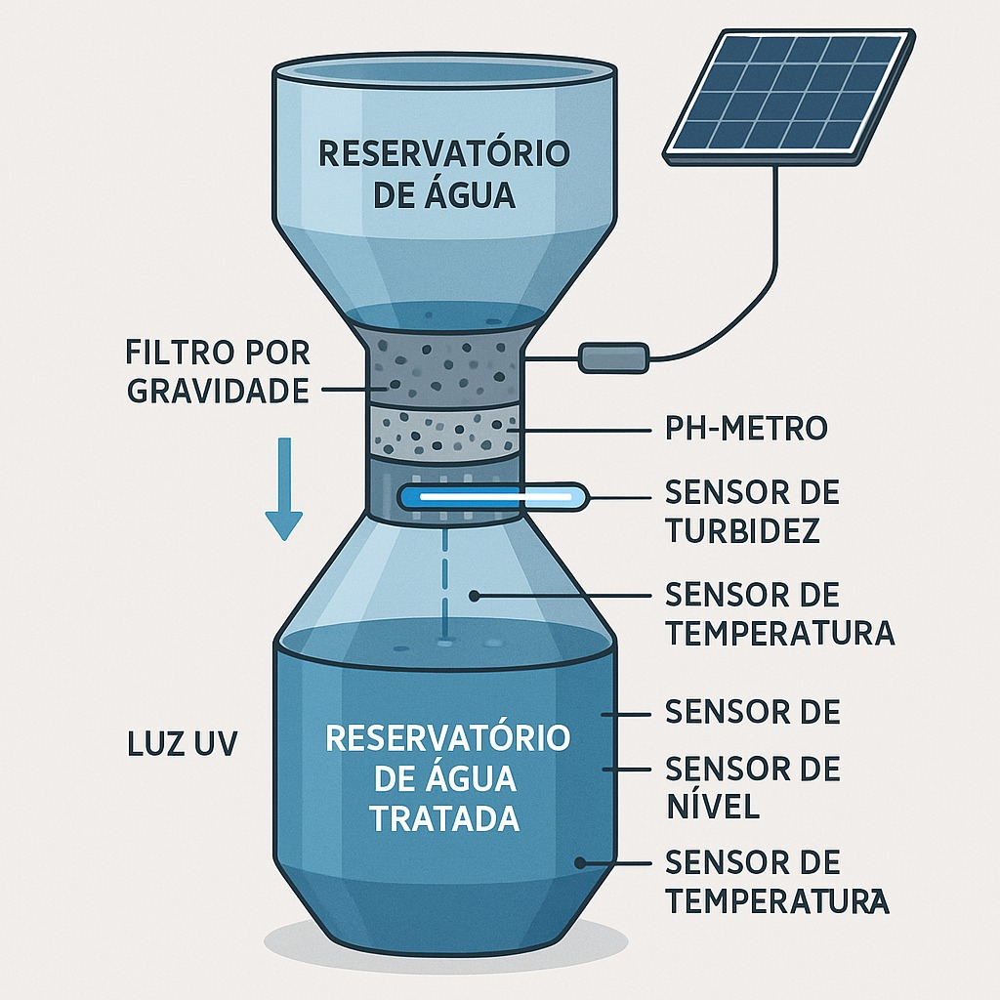

# $FonteViva – Estação-IoT-Autônoma$

Solução voltada ao **monitoramento de recursos hídricos** em cenários de risco e emergência, utilizando sensores físicos, rede MQTT e persistência em banco de dados Oracle via API.



> Uma solução integrada para o armazenamento, reaproveitamento e tratamento inteligente da água, com controle remoto e análise de qualidade em tempo real.

## **Sobre o Projeto**

O **FonteViva** é uma mini estação de tratamento de água projetada para ser portátil, empilhável e de rápida instalação, atuando tanto em cenários de escassez quanto de excesso de água. Ela integra tecnologias sustentáveis, IoT e energia solar para garantir autonomia e eficácia.

### _Componentes do Sistema_

- **Tanque superior:** Armazena água bruta (capacidade: 30–40L)
- **Filtro por gravidade:** Com carvão ativado e camadas filtrantes
- **Controle eletrônico:**
  - Medição de pH, turbidez, temperatura e volume
  - Luz UV para controle microbiológico
  - Comunicação via rede local (MQTT ou HTTP)
- **Energia limpa:** Painel solar alimentando sensores e sistema

### _Estimativa de Custos da Estação FonteViva_

| Item                                   | Descrição                           | Estimativa (R\$) |
| -------------------------------------- | ----------------------------------- | ---------------- |
| Tanque plástico                        | Reservatório superior de água (40L) | R\$ 50,00        |
| Filtro por gravidade                   | Camadas de cascalho, areia e carvão | R\$ 60,00        |
| Sensor de pH                           | Medição da acidez                   | R\$ 45,00        |
| Sensor de turbidez                     | Verifica partículas em suspensão    | R\$ 40,00        |
| Sensor de temperatura                  | Monitoramento térmico da água       | R\$ 30,00        |
| Sensor de nível (ultrassônico)         | Medição de volume disponível        | R\$ 50,00        |
| Módulo UV (esterilização)              | Controle de micro-organismos        | R\$ 70,00        |
| ESP32 / ESP8266                        | Microcontrolador com Wi-Fi          | R\$ 35,00        |
| Módulo MQTT / rede local               | Comunicação dos dados               | R\$ 10,00        |
| Painel solar + controlador + bateria   | Energia limpa e sustentável         | R\$ 150,00       |
| Estrutura física (bomba, tubos, caixa) | Instalação e vedação                | R\$ 90,00        |
| Total estimado por unidade             |                                     | **\~R\$ 630,00** |

> Valores podem reduzir com a parceria de fornecedores.

### _Viabilidade_

A proposta é financeiramente acessível, de fácil transporte (empilhável como copos plásticos) e utiliza energia limpa. Ideal para contextos de emergência, comunidades isoladas ou educação ambiental.

## **Arquitetura da Solução**

- **Backend**: ASP.NET 8.0
- **Banco de Dados**: Oracle XE 21c
- **Containerização**: Docker
- **Rede Docker**: `fonteviva-net`
- **Volumes**: `oracle-data`


---

## **Execução com Docker**

Para essa aplicação criamos uma VM Linux na Azure que atende as nossas necessidades

- [Código para criar VM](/create_vm.sh)

#### **Iniciar a maquina**

O uso do parâmetro `--restart unless-stopped` no container run, garante que o container inicie junto da VM caso ela desligue ou reinicie.

### _Banco Oracle_

Usamos uma Imagem base oficial do Oracle XE:

- container-registry.oracle.com/database/express:21.3.0-xe

Este container fica responsável pelo nosso banco de dados ORACLE, onde foi criado perfis para cada integrante do grupo e um para usuário externo.

- Possui um volume nomeado para persistência de dados de forma local.
  > pode excluir o container e apagar a imagem não tem problema, só criar outro apontando para o mesmo volume

[Dockerfile ORACLE](/database/Dockerfile)

### _Aplicativo ASP.NET_

Parte responsável pela nossa API com toda as comunicação com o banco de dados.

[Dockerfile ASP.NET](/deploy/Dockerfile)

📌 O código esta todo `compilado`, desta forma fica mais _leve_ e carrega consigo todas as dependências da aplicação.

> remove a dependência da IDE e facilita o deploy

- Código fonte ->[ADVANCED-BUSINESS-DEVELOPMENT-WITH-.NET](https://github.com/2TDSPV-GS-01/ADVANCED-BUSINESS-DEVELOPMENT-WITH-.NET)

Ela está dividida em 2 partes:

#### 1. _API_

- Contem todos os métodos HTTP (GET, POST, PUT, DELETE)
  - Salvo _RegistroMedida_ por ser um registro não se pode alterar ou apagar pela API
- Todos os métodos estão documentados por meio do Swagger

#### 2. _Modelo MVC_

- Parte interativa com front
- Permite acessar a documentação da API ou acompanhar nossos sensores

Todas as classes `model` possuem uma classe `controller`, caso necessário podem ser implementados mais telas para visualizar os dados

---

## **Testes CRUD**

Requisições realizadas com `curl`:

### _Create - POST_

```json
{
  "cpf": "46788920677",
  "nome": "Francesco Di Benedetto"
}
```


### _Read - GET_

```sh
http://74.163.240.0:8081/api/ResponsavelApi/46788920677
```


### _Update - PUT_

```bash
{
    "cpf": "46788920677",
    "nome": "Francesco Monteiro Di Benedetto"
}
```


- Confirmação da atualização
  

### _Delete_

```sh
http://74.163.240.0:8081/api/ResponsavelApi/46788920677
```


- Confirmação da exclusão
  

---

## **Evidências (Terminal)**

### _Logs banco de dados_

```bash
$ docker logs oracle-xe
```


### _Logs ASP.NET_

```bash
$ docker logs fonte-viva
```

#### PUT


#### GET

Com o relacionamento 1:N, o Entity Framework faz a consulta com JOIN para retornar as outras classes ligadas a ele


#### UPDATE


#### DELETE


### _Containers_

```bash
$ docker ps
```


### _Imagens_

```bash
$ docker image ls
```


### _Volumes_

```bash
$ docker image ls
```


---

## **Integração com IOT**

Para Solução, usamos protótipos em _ESP32_ com 2 container em VM dedicados

1. Mosquitto (Broker MQTT)
2. Node-RED (Integração HTTP)

O Node-RED atua como middleware entre o protótipo e a API, recebendo os dados via MQTT, formatando e entregando para o backend via HTTP.

---

## **RepositórioS**

- GitHub: [DEVOPS-TOOLS-CLOUD-COMPUTING](https://github.com/2TDSPV-GS-01/DEVOPS-TOOLS-CLOUD-COMPUTING)
- GitHub: [ADVANCED-BUSINESS-DEVELOPMENT-WITH-.NET](https://github.com/2TDSPV-GS-01/ADVANCED-BUSINESS-DEVELOPMENT-WITH-.NET)
- GitHub: [DISRUPTIVE-ARCHITECTURES-IOT-IOB-GENERATIVE-IA](https://github.com/2TDSPV-GS-01/DISRUPTIVE-ARCHITECTURES-IOT-IOB-GENERATIVE-IA)

---

## **Vídeo Demonstração**

YouTube: [DEVOPS](https://www.youtube.com/watch?v=RmSBid0cin0)

---

## **Integrantes**

- Nome: Francesco Di Benedetto
  RM: RM557313
- Nome: Nathalia Gomes da Silva
  RM: RM554945
- Nome: Gustavo Goulart Bretas
  RM: RM555708
